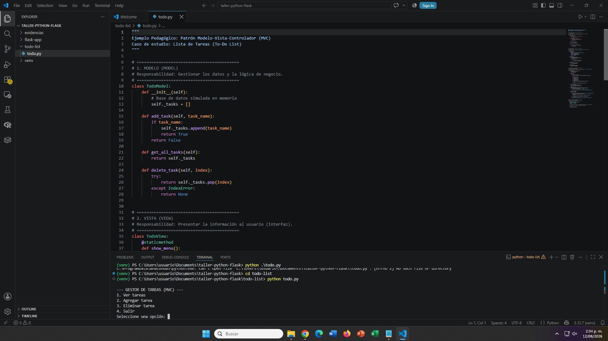
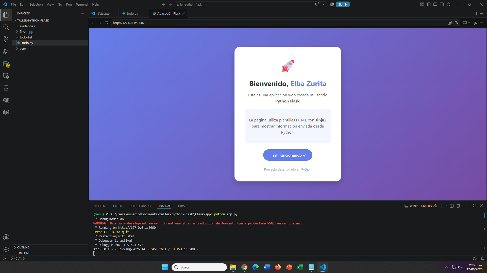

# Aplicaciones Python - To Do List y Flask

## Descripción

Este repositorio contiene dos aplicaciones desarrolladas en Python como parte del taller:

- **Aplicación To-Do List:** Aplicación de consola para gestionar tareas.
- **Aplicación Flask:** Aplicación web desarrollada utilizando el framework Flask y templates HTML.

---

# 1. Aplicación To-Do List

## Ubicación

```bash
todo-list/
```

## Ejecución

Ingresar a la carpeta de la aplicación:

```bash
cd todo-list
```

Ejecutar el programa:

```bash
python todo.py
```

La aplicación permite visualizar, agregar y eliminar tareas desde la consola.

---

## Evidencia de ejecución



---

# 2. Aplicación Flask

## Ubicación

```bash
flask-app/
```

## Crear entorno virtual

Ingresar a la carpeta Flask:

```bash
cd flask-app
```

Crear un entorno virtual:

```bash
python -m venv venv
```

---

## Activar entorno virtual

En Windows:

```bash
venv\Scripts\activate
```

---

## Instalar librerías

Instalar las dependencias del proyecto:

```bash
pip install -r requirements.txt
```

Verificar librerías instaladas:

```bash
pip list
```

---

## Ejecutar aplicación Flask

Ejecutar el servidor:

```bash
python app.py
```

Abrir en el navegador:

```
http://127.0.0.1:5000/
```

---

## Evidencia de ejecución



---

# Comandos Git utilizados

## Inicializar repositorio local

Crear un repositorio Git:

```bash
git init
```

---

## Ver estado de cambios

Consultar archivos modificados:

```bash
git status
```

---

## Agregar archivos al repositorio

Agregar todos los archivos:

```bash
git add .
```

Agregar un archivo específico:

```bash
git add nombre_archivo
```

---

## Crear commit

Guardar cambios realizados:

```bash
git commit -m "Descripción del cambio"
```

Ejemplo:

```bash
git commit -m "Primera entrega del proyecto"
```

---

## Consultar historial de cambios

Ver commits realizados:

```bash
git log
```

---

# Creación de repositorio en GitHub

Después de crear el repositorio público en GitHub:

Vincular el repositorio local:

```bash
git remote add origin URL_DEL_REPOSITORIO
```

Ejemplo:

```bash
git remote add origin https://github.com/usuario/taller-python-flask.git
```

Verificar conexión:

```bash
git remote -v
```

---

# Publicación del proyecto en GitHub

Cambiar la rama principal a main:

```bash
git branch -M main
```

Subir proyecto al repositorio:

```bash
git push -u origin main
```

---

# Control de cambios posteriores

Consultar modificaciones:

```bash
git status
```

Agregar nuevos cambios:

```bash
git add .
```

Crear nuevo commit:

```bash
git commit -m "Actualización del proyecto"
```

Publicar cambios:

```bash
git push
```

---

# Estructura del proyecto

```
taller-python-flask
│
├── todo-list
│   └── todo.py
│
├── flask-app
│   ├── app.py
│   ├── requirements.txt
│   └── templates
│       └── index.html
│
├── evidencias
│   ├── todo.png
│   └── flask.png
│
└── README.md
```

---

# Autor

**Alejandro López**

Proyecto académico - Python Flask
